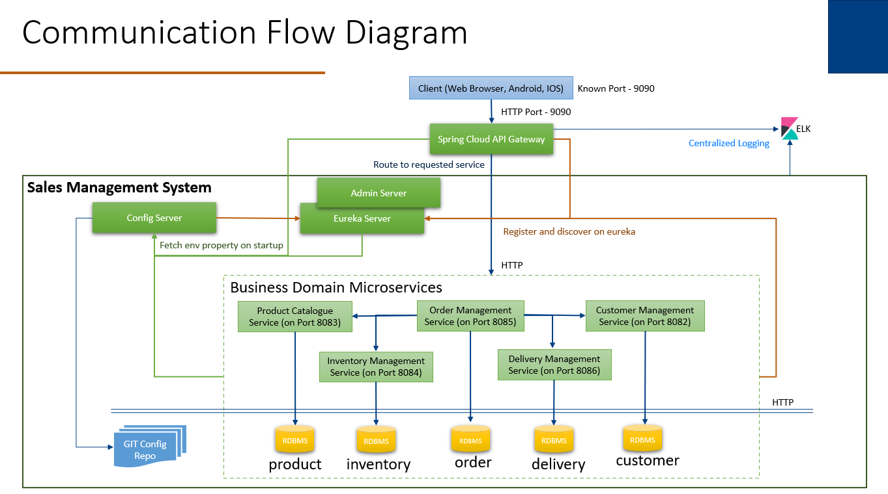

# Microservice Design Pattern
## Design Pattern Used
### Decomposition Patterns
  - Decompose by Business Capability
### Integration Patterns
  - API Gateway Pattern
  - Aggregator Pattern
  - Proxy Pattern
  - Gateway Routing Pattern
  - Chained Microservice Pattern
### Database Patterns
  - Database per Service
### Observability Patterns
  - Log Aggregation
  - Health Check
### Cross-Cutting Concern Patterns
  - External Configuration
  - Service Discovery Pattern
## Project architecture


### Features:
  - API Gateway
  - Service Registration and Discovery
  - External Configuration
  - Property value Encryption/Decryption
  - Log Aggregation
  - Microservice Monitoring.
  
### ELK:
  - Centralized Logging
  
### System Micro Services:
  - Config Server:
    - Centralized Configuration of the application.
    - External Configuration.
  - Eureka and Admin Server:
    - Service Registry and Discovery.
    - Micro Service Monitoring with Spring Boot Admin.
  - API Gateway:
    - All Services should be accessible with single gateway.
    - Gateway Routing

### Business Domain Micro Services:
  - Customer Management Service:
    - Stores the Customer Information.
    - Retrieve all Customers.
    - Retrieve customer details based on customer ID.
    - Update Customer.
    - Delete the customer base on its CustomerID.
  - Product Catalogue Service:
    - Creates the product into the system against the given product Id.
    - Retrieves all Product.
    - Retrieves the Product details against the given Product ID.
    - Updates the Product details into the system.
    - Deletes the details of given product from the system.
  - Inventory Management Service:
    - Add the new inventory into the system.
    - Updates the new inventory details into the system.
    - Deletes the given inventory details from the system.
    - Retrieves the Inventory details against the given product ID.
    - Retrieves all Inventory.
  - Oder Management Service:
    - Creates the order against the supplied data.
  - Delivery Management Service:
    - Creates the delivery details.
    - Get the delivery details against given Customer Id.    
        
## Technologies Used
  - Java 1.8
  - Spring Boot
  - Spring Cloud (Netflix Eureka Server, Config, Gatway, OpenFeign)
  - Spring Data, Hibernate
  - Spring Boot Actuator and Spring Boot Admin
  - MSSQL Database
  - Swagger API (UI for testing of APIs)
  - ELK
  
## Softwares Pre-requisite
  - Java 1.8
  - Maven
  - GIT
  - Java IDE (STS or Eclipse)


## Project Configuration

### ELK stack configuration
  - Elasticsearch:
    - Download latest version of Elasticsearch from this download page (https://www.elastic.co/downloads/elasticsearch) and unzip it to any folder.
    - Run bin\elasticsearch.bat from command prompt.
    - By default, it would start at http://localhost:9200
    
  - Logstash:
    - Download the latest distribution from download page(https://www.elastic.co/downloads/logstash) and unzip into any folder.
    - Create one file logstash.conf with below content under bin folder.
    - Now run bin/logstash -f logstash.conf to start logstash.
    - Once started successfully, use the configured port 5044 in logback.xml file of your microserice.
    
##### logstash.conf
    		
```conf
			input {
				 tcp {
				  port => 5044
				  codec => "json"
				 }
				}
				
			output {
			  elasticsearch {
			    hosts => ["http://localhost:9200"]
			    index => "ace-msdp"
			    #user => "elastic"
			    #password => "changeme"
			  }
			}
```

  
  - Kibana:
    - Download the latest distribution from download page(https://www.elastic.co/downloads/kibana) and unzip into any folder.
    - Open config/kibana.yml and set elasticsearch.url with "http://localhost:9200".
    - Run bin\kibana.bat from command prompt.
    - Once started successfully, access it on http://localhost:5601.
    - Configure the Index Patterns to see the logs.
		
## How to Run the project
### Run ELK
    Run ELK using the command given in ELK stack configuration..
### Run Configuration Server
    Import 'ConfigurationServer' as Maven project and Run it as Spring boot application.
### Run Eureka Server
    Import 'EurekaServer' as Maven project and Run it as Spring boot application.
### Run API Gateway
    Import 'APIGateway' as Maven project and Run it as Spring boot application.
### Run Customer Management Service
    Import 'customer-management-api' as Maven project and Run it as Spring boot application.
### Product Catalogue Service
    Import 'product-catalog-api' as Maven project and Run it as Spring boot application.
### Run Inventory Management Service
    Import 'inventory-api' as Maven project and Run it as Spring boot application.
### Run Oder Management Service
    Import 'order-service-api' as Maven project and Run it as Spring boot application.
### Run Delivery Management Service
    Import 'delivery-management-api' as Maven project and Run it as Spring boot application.
